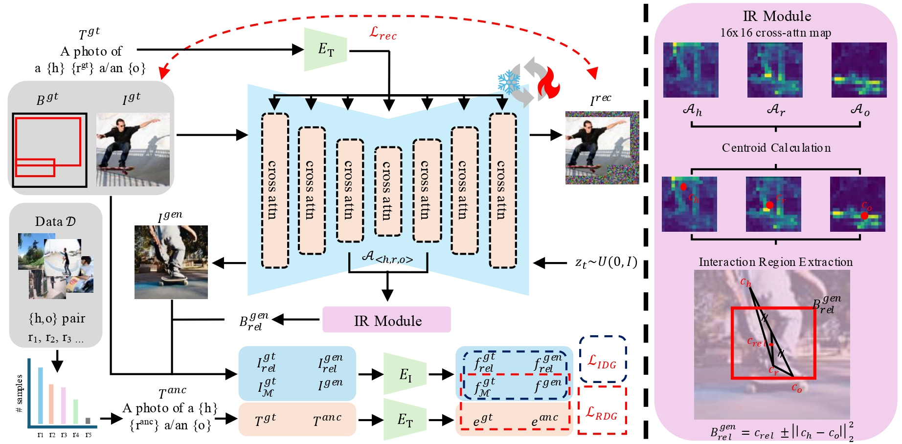

# VerbDiff : Text-Only Diffusion Models with Enhanced Interaction Awareness (25' CVPR)

SeungJu Cha, [Kwanyoung Lee](https://github.com/mobled37), Ye-Chan Kim,
Hyunwoo Oh, Dong-Jin Kim*

[paper]()
[arXiv](https://arxiv.org/abs/2503.16406)

- VerbDiff is a novel text-to-image generation model that weakens the bias between interaction words and objects, enhancing the understanding of interactions.

## Description

Code will be available soon!
